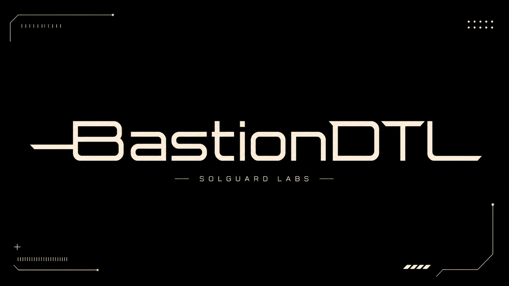

# BastionDTL



BastionDTL es un simulador C++20 de custodia DTL con cuentas segregadas,
operadores autorizados, politicas economicas por cuenta y liquidacion mediante
recibos firmados. El proyecto modela flujos internos de tesoreria donde una
cuenta de custodia paga a beneficiarios, registra fees operativos y mueve
reservas de liquidacion.

La salida JSON de la CLI es el contrato principal para integraciones y tests
TypeScript. No requiere servicios externos ni base de datos.

## Componentes

- `src/common`: tipos fuertes, importes, digest determinista y emision JSON.
- `src/security`: identidades, roles y firmas deterministas de laboratorio.
- `src/custody`: cuentas segregadas, ledger, politicas y reconciliacion.
- `src/receipt`: recibos firmados y manifiestos de handoff.
- `src/settlement`: liquidacion individual y batch.
- `src/runtime`: escenarios reproducibles y CLI.

## Requisitos

- Node.js 20 o superior.
- Bun 1.3 o superior.
- Un compilador C++20 disponible como `clang++`, `g++`, `c++` o `cl`.

En Windows con MSVC, ejecutar desde una Developer Prompt o dejar que
`scripts/build.mjs` localice `vcvars64.bat`.

## Uso

Compilar:

```bash
node scripts/build.mjs
```

Listar escenarios:

```bash
out/bastiondtl list --json
```

Ejecutar un escenario:

```bash
out/bastiondtl scenario rotation --json
```

Escenarios disponibles:

- `receipts`: liquidacion de un recibo firmado.
- `permissions`: validaciones de operador, retirada y cuenta congelada.
- `rotation`: handoff entre operadores.
- `withdrawals`: reglas de retirada por propietario.
- `closure`: cierre de cuenta vacia.
- `snapshot`: batch con reconciliacion completa.

## Tests

```bash
bun test --timeout 30000 ./tests/node
```

o bien:

```bash
npm test
```

Los tests TypeScript compilan el binario si no existe y validan la CLI, permisos,
recibos, retiradas, rotacion de operadores, cierres de cuenta, batches y
reconciliacion de ledger.

## CI Local

```bash
bash scripts/ci.sh
```

El pipeline ejecuta:

- build C++20 con warnings estrictos cuando el compilador lo permite;
- tests TypeScript con Bun;
- validacion del contrato JSON emitido por la CLI.

## Estado

BastionDTL esta disenado como un repositorio de auditoria autocontenido. Las
firmas y digests son deterministas para hacer reproducibles los escenarios de
laboratorio; cualquier uso productivo deberia sustituirlos por primitivas
criptograficas revisadas y controles operativos externos.
