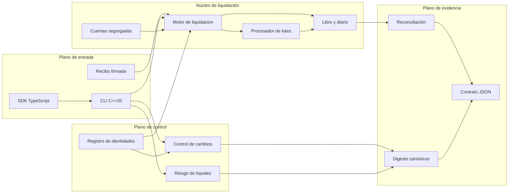
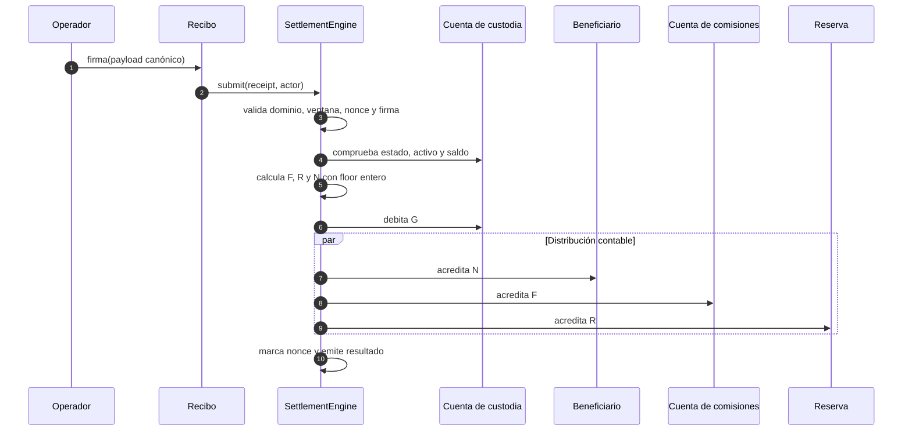
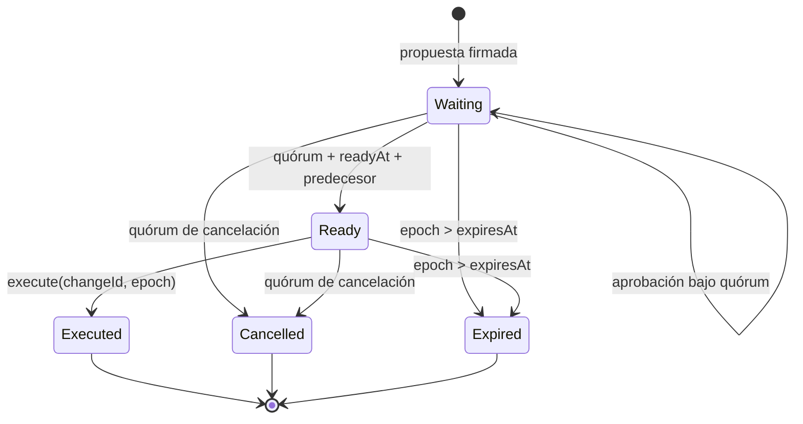

# BastionDTL


[](https://github.com/SolguardLabs/BastionDTL/actions/workflows/ci.yml)
[](https://github.com/SolguardLabs/BastionDTL/releases)
[](https://isocpp.org/)
[](https://bun.sh/)
[](./LICENSE)

BastionDTL es un motor de custodia segregada y liquidación determinista escrito en C++20. El
protocolo coordina cuentas de custodia, operadores delegados, recibos firmados, distribución de
comisiones, reservas, reconciliación contable y controles de liquidez. Su interfaz JSON permite
integrarlo desde procesos de tesorería, sistemas de conciliación y clientes TypeScript.

La versión `1.0.0` incorpora dos planos adicionales: un motor de riesgo de liquidez con escenarios
de estrés y concentración HHI, y un control de cambios firmado con pesos, quórum, espera mínima,
caducidad y encadenamiento de operaciones.

## Capacidades

- cuentas por activo con saldos disponibles, reservados y bloqueados;
- roles separados para propietario, tesorería, operador, auditor y beneficiario;
- recibos con dominio, nonce, ventana temporal, política y firma verificables;
- liquidación atómica en tres tramos: beneficiario, comisión y reserva;
- lotes con manifiesto canónico y digest determinista;
- rotación operativa, congelación, retirada y cierre de cuentas;
- reconciliación de suministro, políticas y estados de cuenta;
- cobertura de liquidez, déficit por cuenta, concentración y límites de cartera;
- gobierno firmado con revisores ponderados y retardo de ejecución;
- SDK TypeScript con aritmética `bigint` y transporte nativo fail-closed.

## Arquitectura



| Módulo           | Responsabilidad                                                 |
| ---------------- | --------------------------------------------------------------- |
| `src/common`     | Tipos de dominio, importes seguros, serialización y digests.    |
| `src/security`   | Identidades, roles, habilitación y verificación de firmas.      |
| `src/custody`    | Cuentas, balances, grants de operador, diario y reconciliación. |
| `src/receipt`    | Construcción de recibos y manifiestos canónicos.                |
| `src/settlement` | Decisión, reparto económico y procesamiento por lotes.          |
| `src/risk`       | Estrés de entradas/salidas, cobertura, déficit y HHI.           |
| `src/governance` | Propuestas firmadas, votos ponderados, timelock y ejecución.    |
| `src/runtime`    | Escenarios, contrato JSON, versión y CLI.                       |
| `sdk`            | Cliente TypeScript y modelo económico equivalente con `bigint`. |

## Modelo de liquidación

Para un importe bruto `G`, una comisión `f` y una reserva `r`, expresadas en puntos básicos:

```text
F = floor(G × f / 10 000)
R = floor(G × r / 10 000)
N = G - F - R
```

`F` se acredita a la cuenta de comisiones, `R` a la cuenta de reserva y `N` al beneficiario. Las
operaciones se calculan con enteros, verificación de rango y resta comprobada. El suministro total
del activo debe permanecer constante durante el movimiento interno.



## Modelo de liquidez

Cada cuenta `i` aporta una posición con disponible `Aᵢ`, reserva `Rᵢ`, entrada esperada `Iᵢ` y
salida comprometida `Oᵢ`. Los factores `ρ`, `σ` y `λ` representan recuperación de entradas, estrés
de salidas y liberación de reserva:

```text
Iᵢ* = floor(Iᵢ × ρᵢ / 10 000)
Oᵢ* = Oᵢ + floor(Oᵢ × σᵢ / 10 000)
Rᵢ* = floor(Rᵢ × λᵢ / 10 000)
Uᵢ  = Aᵢ + Iᵢ* + Rᵢ*
Dᵢ  = max(Oᵢ* - Uᵢ, 0)
LCR = floor(ΣUᵢ × 10 000 / ΣOᵢ*)
HHI = Σ floor(sᵢ² / 10 000),  sᵢ = floor(Oᵢ* × 10 000 / ΣOᵢ*)
```

Una cartera se mantiene dentro de límites solo cuando satisface simultáneamente cobertura mínima,
déficit máximo, participación individual máxima y HHI máximo. Consulte
[Riesgo de liquidez](./docs/liquidity-risk.md) para un ejemplo numérico completo.

## Control de cambios



Los revisores tienen un peso explícito. Una aprobación no se cuenta dos veces y todas las firmas
incluyen dominio, digest de la propuesta e identidad del revisor. La ejecución exige que la
propuesta esté en estado `ready`, haya alcanzado el quórum y, si existe, que su predecesora esté
ejecutada.

## Requisitos

- Windows, Linux o macOS;
- Node.js `24` o posterior;
- Bun `1.3.14`;
- compilador C++20: MSVC, GCC o Clang;
- CMake `3.20` o posterior si se usa el flujo CMake.

En Windows, `scripts/build.mjs` detecta las instalaciones habituales de Visual Studio Build Tools y
carga `vcvars64.bat`. También puede ejecutarse desde una Developer PowerShell.

## Inicio rápido

```bash
bun install --frozen-lockfile
bun run build
out/bastiondtl list --json
out/bastiondtl scenario snapshot --json
```

En PowerShell:

```powershell
bun install --frozen-lockfile
bun run build
.\out\bastiondtl.exe scenario liquidity --json
```

Escenarios disponibles:

| Escenario     | Propósito                                        |
| ------------- | ------------------------------------------------ |
| `receipts`    | Liquidación de beneficiario, comisión y reserva. |
| `permissions` | Controles de firma, retirada y congelación.      |
| `rotation`    | Continuidad durante un cambio de operador.       |
| `withdrawals` | Política de retirada por propietario.            |
| `closure`     | Cierre controlado de una cuenta vacía.           |
| `snapshot`    | Lote, manifiesto, diario y reconciliación.       |
| `liquidity`   | Estrés, cobertura, déficit y concentración.      |
| `governance`  | Propuesta firmada, quórum y timelock.            |

## SDK TypeScript

```ts
import { BastionClient, NativeBastionTransport } from "./sdk/BastionClient";

const client = new BastionClient(
  new NativeBastionTransport({
    binary: process.platform === "win32" ? "out/bastiondtl.exe" : "out/bastiondtl",
  }),
);

const snapshot = client.requireHealthy("snapshot");
console.log(snapshot.stateDigest);
```

El SDK rechaza rutas de escenario no válidas, respuestas JSON mal formadas y controles con resultado
negativo. Su evaluador de liquidez usa `bigint` y replica el redondeo `floor` del núcleo.

## Calidad y verificación

```bash
bun run ci
```

El control local ejecuta:

1. compilación C++20 con warnings tratados como error;
2. comprobación estricta de tipos TypeScript;
3. pruebas de integración y SDK;
4. formato determinista;
5. verificación de estructura, documentación y metadatos.

La CI repite el mismo contrato en GitHub Actions. Los tags y releases ejecutan además una
comprobación de integridad entre versión, tag, rama de producción y artefactos fuente.

## Documentación

- [Arquitectura](./docs/architecture.md)
- [Modelo de liquidación](./docs/settlement-model.md)
- [Riesgo de liquidez](./docs/liquidity-risk.md)
- [Control de cambios](./docs/change-control.md)
- [Operación](./docs/operations.md)
- [SDK](./docs/sdk.md)
- [Runbooks](./docs/runbooks.md)

## Seguridad

El modelo de confianza, los invariantes y el proceso de notificación se describen en
[SECURITY.md](./SECURITY.md). No incluya material sensible en issues públicas; utilice la pestaña
**Security** del repositorio para una comunicación privada.

## Licencia

[MIT](./LICENSE) © 2026 SolguardLabs.
