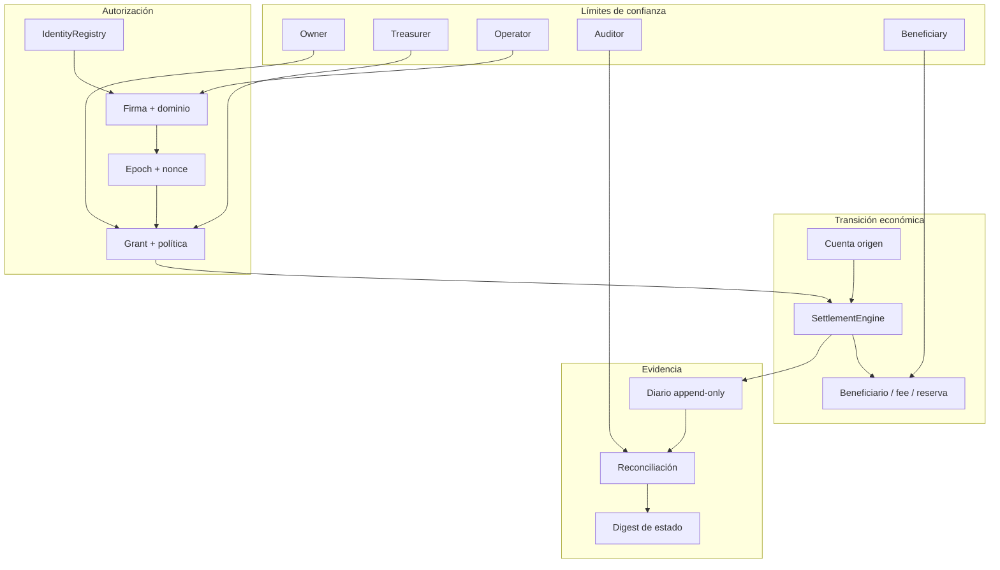
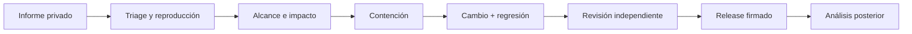

# Política de seguridad

BastionDTL procesa autorizaciones, estados contables y decisiones económicas. Su seguridad depende
de mantener alineados identidad, recibo, política, cuenta, activo, nonce, ventana temporal y diario.
Este documento define el modelo de confianza, los controles activos y el canal de notificación.

## Versiones mantenidas

| Versión   | Estado           | Actualizaciones de seguridad |
| --------- | ---------------- | ---------------------------- |
| `1.0.x`   | Mantenida        | Sí                           |
| `< 1.0.0` | Fuera de soporte | No                           |

Las ramas `main` y `production` deben apuntar a revisiones con CI verde. Los releases se construyen
desde un tag anotado y verifican que `package.json`, `BuildInfo` y CMake declaren la misma versión.

## Modelo de confianza



### Roles

| Rol           | Facultades                                   | Restricciones principales                  |
| ------------- | -------------------------------------------- | ------------------------------------------ |
| `Owner`       | Gestiona su cuenta y participa en cambios.   | No administra cuentas de otro propietario. |
| `Treasurer`   | Fondeo, barridos permitidos y propuestas.    | Su acción queda sujeta a política y firma. |
| `Operator`    | Emite y presenta recibos autorizados.        | No retira fondos ni gestiona cuentas.      |
| `Auditor`     | Revisa evidencia y vota cambios autorizados. | No mueve balances.                         |
| `Beneficiary` | Recibe el tramo neto.                        | No decide política ni distribución.        |

## Invariantes económicos

1. **Conservación:** un movimiento interno no crea ni destruye unidades del activo.
2. **No negatividad:** disponible, reservado y bloqueado permanecen en rango no negativo.
3. **Segregación:** origen y destinos deben existir y usar el mismo activo.
4. **Exactitud del reparto:** `gross = beneficiary + fee + reserve`.
5. **Unicidad:** un nonce de recibo se consume una sola vez por cuenta origen.
6. **Ventana:** el epoch de ejecución debe estar dentro de `notBefore..expiresAt`.
7. **Estado:** una cuenta congelada, en cierre o cerrada no acepta operaciones incompatibles.
8. **Suministro:** la suma por activo del libro coincide con el suministro registrado.
9. **Liquidez:** cobertura, déficit y concentración usan enteros y límites explícitos.
10. **Gobierno:** una propuesta se ejecuta una vez, tras quórum, espera y predecesor.

## Controles activos

### Autorización y replay

- payloads con dominio distinto para propuesta, aprobación, cancelación y recibo;
- identidad firmante incluida en el mensaje canónico;
- rechazo de identidades deshabilitadas o con rol incompatible;
- nonce y `receiptId` registrados antes de aceptar una repetición;
- voto único por revisor y operación;
- propuestas finalizadas no pueden reabrirse.

### Aritmética

- importes representados con enteros de 64 bits en el núcleo;
- sumas, restas y multiplicaciones con comprobación de rango;
- ratios calculados mediante reducción por máximo común divisor;
- redondeo `floor` explícito para puntos básicos;
- SDK basado en `bigint`, sin conversión implícita a flotante;
- saturación solo en medidas donde el contrato la declara.

### Cambios operativos

- propuesta firmada por `Owner` o `Treasurer`;
- revisores configurados con peso entre 1 y 100;
- quórum separado de aprobación y cancelación;
- `readyAt` posterior a `proposedAt`;
- `expiresAt` posterior a `readyAt`;
- encadenamiento opcional mediante `predecessor`;
- digest determinista del estado de gobierno.

### Integridad de entrega

- dependencias fijadas en `bun.lock`;
- compilación con `-Wall -Wextra -Wpedantic -Werror` o `/W4 /WX`;
- comprobación de tipos estricta;
- CI para ramas, pull requests, tags y releases;
- Dependabot para npm y GitHub Actions;
- verificación de referencias y versión de release.

## Datos sensibles

No registre secretos, credenciales, material de firma, tokens, claves privadas o datos personales
en:

- código fuente;
- fixtures;
- logs de CI;
- issues;
- comentarios de pull requests;
- archivos `.env`.

Los valores deterministas de `IdentityRegistry` forman parte del contrato reproducible del motor y
no deben reutilizarse como credenciales externas. Las integraciones deben suministrar su propio
proveedor de firma y su política de gestión de claves.

## Notificación privada

Para comunicar un hallazgo de seguridad:

1. abra la pestaña **Security** del repositorio;
2. seleccione **Report a security issue**;
3. describa la versión, el componente y la precondición;
4. adjunte una reproducción mínima que no contenga secretos;
5. cuantifique el efecto contable y el invariante afectado;
6. indique si existe una mitigación operativa temporal.

Evite issues públicas mientras el informe esté en revisión. Se confirmará la recepción, se
clasificará el alcance y se coordinará una corrección y publicación responsable cuando proceda.

## Contenido esperado del informe

```text
Version / commit:
Component:
Preconditions:
Expected invariant:
Observed state transition:
Economic impact:
Minimal reproduction:
Suggested regression test:
Temporary mitigation:
```

## Respuesta operativa



La contención puede incluir congelar una cuenta, retirar un operador, elevar temporalmente el
quorum, detener lotes, restringir retiradas o reducir límites de liquidez. Toda medida debe quedar
registrada y tener criterio de reversión.
