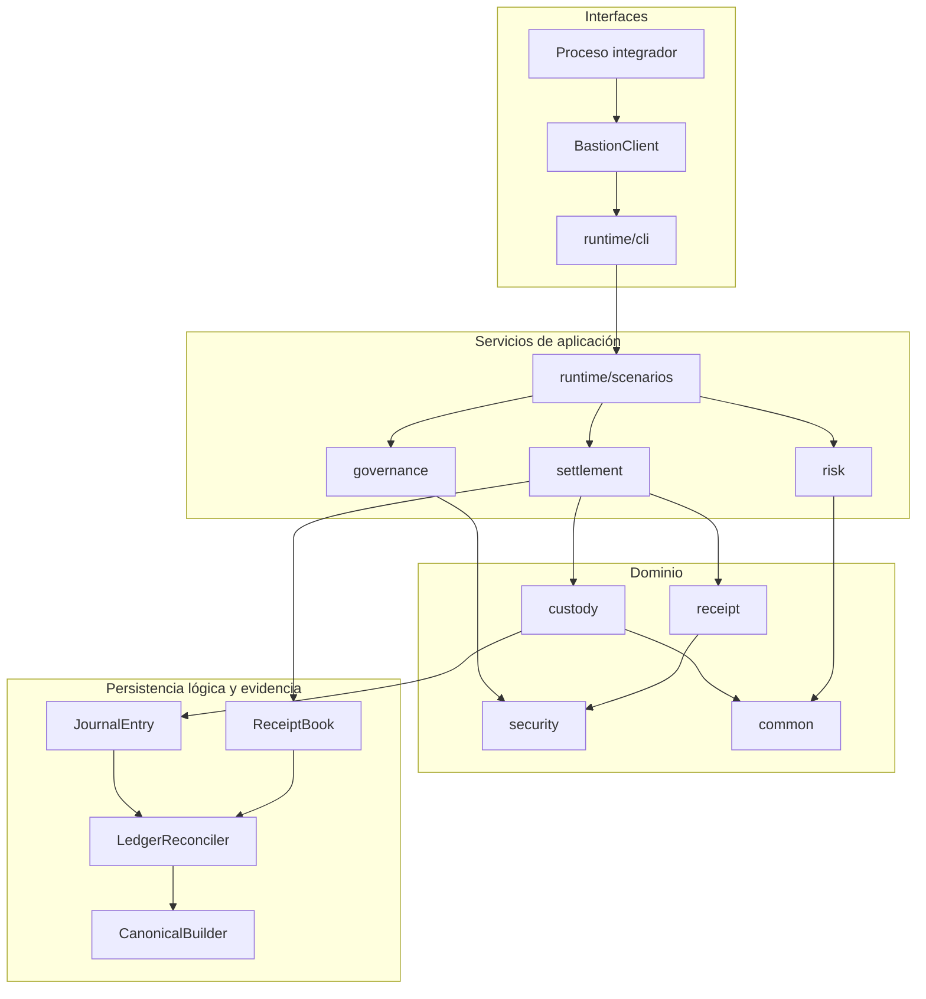
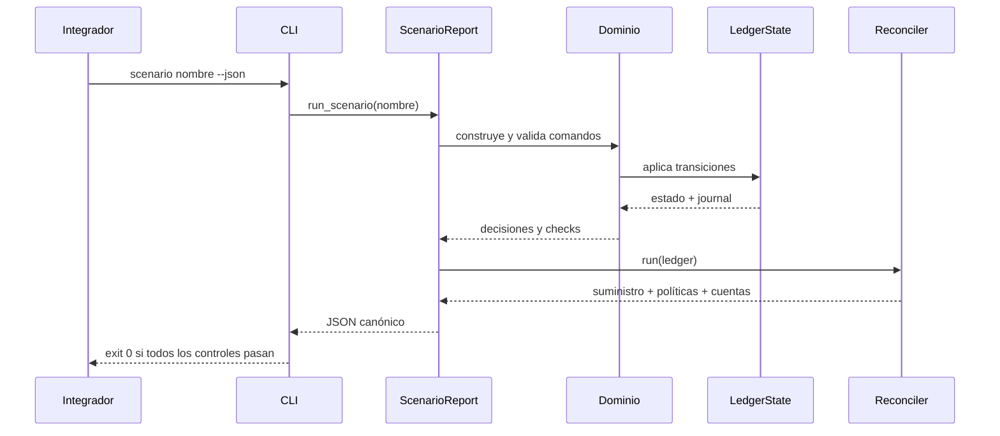

# Arquitectura de BastionDTL

## Objetivo

BastionDTL separa el dominio contable del transporte y de la presentación. El binario nativo
contiene el estado, las reglas de autorización y la aritmética; la CLI expone escenarios mediante
JSON; el SDK TypeScript valida ese contrato y ofrece cálculos de cartera equivalentes.

El diseño busca cuatro propiedades:

1. transiciones deterministas y reproducibles;
2. importes enteros sin aritmética de coma flotante;
3. fronteras explícitas entre identidad, autorización y movimiento económico;
4. evidencia canónica suficiente para reconciliar cada estado.

## Capas



### `common`

Define identificadores fuertes (`AccountId`, `IdentityId`, `ReceiptId`, `PolicyId`, `AssetId`),
`Epoch`, `Nonce`, `Amount`, `BasisPoints`, el constructor de payloads canónicos y el escritor JSON.
Las validaciones tempranas impiden que un identificador libre alcance las capas económicas.

`Amount` encapsula:

- suma y resta comprobadas;
- resta saturada cuando la métrica lo requiere;
- multiplicación por puntos básicos;
- comparación y serialización estable.

### `security`

`IdentityRegistry` mantiene identidades, roles, estado habilitado y material de verificación. Los
mensajes se firman sobre un payload canónico con dominio. Cada consumidor verifica además el rol
admitido; una firma correcta no concede por sí sola una facultad.

### `custody`

`LedgerState` es el agregado principal. Mantiene:

- cuentas segregadas por activo;
- suministro interno por activo;
- grants históricos y grant corriente;
- epoch operativo;
- recibos consumidos;
- diario ordenado de operaciones.

`CustodyAccount` aplica estados `open`, `frozen`, `closing` y `closed`. El movimiento de fondos pasa
por el libro; las capas superiores no escriben balances directamente.

### `receipt`

`SettlementReceipt` describe origen, beneficiario, importe, nonce, ventana, operador emisor,
política y firma. `ReceiptManifest` ordena y agrupa recibos para un handoff o lote, generando un
digest estable.

### `settlement`

`SettlementEngine` evalúa una solicitud, calcula los tres tramos y registra el resultado.
`BatchSettlementProcessor` añade identificador de lote, submitter, estrategia de continuación y
digest del conjunto de decisiones.

### `risk`

`LiquidityRiskEngine` consume posiciones ya ordenadas por cuenta. Calcula recursos utilizables,
salidas estresadas, déficit, excedente, cobertura y concentración. El resultado incluye un digest
que vincula entradas, totales y decisión de límites.

### `governance`

`ChangeControl` mantiene propuestas y votos en mapas ordenados. Las aprobaciones y cancelaciones
usan dominios distintos. El estado se deriva del epoch, los pesos, el predecesor y los flags de
finalización.

### `runtime`

Los escenarios son composiciones de dominio, no mocks del protocolo. Cada uno entrega el mismo
sobre:

```json
{
  "ok": true,
  "scenario": "snapshot",
  "networkId": "bastion-mainnet",
  "epoch": 1,
  "stateDigest": "...",
  "checks": [],
  "reconciliation": {},
  "liquidity": null,
  "governance": null,
  "ledger": {}
}
```

## Ciclo de una operación



## Propiedad y dependencias

La dirección de dependencias es intencional:

- `common` no depende de capas de dominio;
- `security` depende solo de `common`;
- `custody`, `receipt`, `risk` y `governance` dependen de primitivas inferiores;
- `settlement` coordina `custody` y `receipt`;
- `runtime` puede componer todos los módulos;
- `sdk` se comunica por el contrato CLI y no enlaza memoria C++.

Esto permite sustituir transporte, almacenamiento o proveedor de firmas sin reescribir la aritmética
del protocolo.

## Determinismo

Los mapas ordenados y las listas canónicas evitan que el orden de inserción altere un digest. Cada
payload incluye un dominio. Los tests ejecutan escenarios repetidos y comparan digests, saldos y
métricas exactas.

No deben introducirse:

- timestamps de reloj de pared en payloads;
- serialización de mapas sin ordenar;
- conversiones de importes a `double`;
- dependencias de locale;
- IDs generados fuera del dominio de nonce/epoch definido.

## Extensión segura

Para añadir un comando:

1. defina tipos y validaciones en la capa de dominio correspondiente;
2. mantenga la escritura de balances dentro de `LedgerState`;
3. asigne un dominio nuevo a cada payload firmado;
4. serialice el resultado con claves estables;
5. añada un escenario nominal y rechazos relevantes;
6. amplíe tipos y validación del SDK;
7. documente invariantes y procedimiento operativo;
8. ejecute `bun run ci`.
