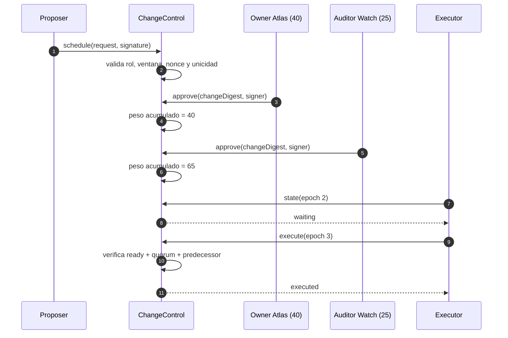
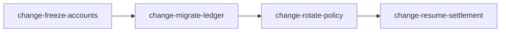

# Control de cambios

## Alcance

`ChangeControl` coordina modificaciones sensibles sin mezclar el voto con la aplicación económica.
Una propuesta describe una intención inmutable; las firmas confirman esa intención; el timelock y el
quórum determinan cuándo puede ejecutarse.

Casos habituales:

- rotación de una política;
- ajuste de límites de liquidez;
- alta o retirada de un operador;
- activación de un nuevo adaptador;
- cambio de cuenta de reserva;
- secuencia de migración con predecesores.

## Propuesta

```text
ChangeRequest
  id                identificador único
  target            recurso de destino
  action            operación declarada
  parameterDigest   compromiso de parámetros
  predecessor       cambio previo opcional
  proposer          owner o treasurer
  proposedAt        epoch de propuesta
  readyAt           primer epoch ejecutable
  expiresAt         último epoch vigente
  nonce             número no nulo
```

El payload usa el dominio `bastion-change-request-v1`. `parameterDigest` evita que los revisores
tengan que firmar una representación externa ambigua: primero se canonizan los parámetros y luego se
firma su compromiso.

## Validaciones temporales

```text
proposedAt < readyAt < expiresAt
nonce > 0
```

El estado se deriva así:

```text
executed                               -> Executed
cancelled                              -> Cancelled
epoch > expiresAt                      -> Expired
epoch >= readyAt AND approvals >= Q
  AND predecessor executed             -> Ready
otherwise                              -> Waiting
```

## Revisores y pesos

Los roles admitidos son `Owner`, `Treasurer` y `Auditor`. Cada revisor se configura con un peso
entre 1 y 100. El peso se captura al registrar el voto, por lo que el informe conserva la
contribución exacta usada en la decisión.

Ejemplo:

| Revisor         | Rol     | Peso |
| --------------- | ------- | ---: |
| `owner:atlas`   | Owner   |   40 |
| `owner:forge`   | Owner   |   35 |
| `auditor:watch` | Auditor |   25 |

Con quórum de aprobación `65`, Atlas y Auditor alcanzan exactamente el umbral. Atlas por sí solo no
lo alcanza. Dos votos de la misma identidad se rechazan.

## Dominios firmados

| Operación | Dominio                          | Campos vinculados                   |
| --------- | -------------------------------- | ----------------------------------- |
| Proponer  | `bastion-change-request-v1`      | todos los campos de `ChangeRequest` |
| Aprobar   | `bastion-change-approval-v1`     | digest del cambio + revisor         |
| Cancelar  | `bastion-change-cancellation-v1` | digest del cambio + revisor         |

No reutilice una firma entre operaciones. Aunque el cambio y el revisor coincidan, el dominio impide
interpretar una cancelación como aprobación.

## Secuencia nominal



## Cancelación

El quórum de cancelación es independiente. Al alcanzarlo, `cancelled` se vuelve final. Una propuesta
cancelada no puede aprobarse ni ejecutarse. La firma cubre el mismo digest de propuesta para evitar
que una cancelación afecte a una revisión con igual etiqueta y parámetros distintos.

## Predecesores

Una propuesta puede referir otra mediante `predecessor`. El estado `Ready` exige que esa propuesta
previa exista y esté ejecutada. Esto permite modelar migraciones ordenadas:



No forme ciclos. La capa que construye el plan debe validar un grafo acíclico y asignar IDs únicos.

## Digest de evidencia

El informe se construye en orden de `changeId` e incluye:

```text
domain = bastion-change-control-report-v1
epoch
for each change:
  changeDigest:state
```

El JSON conserva además target, action, nonce, ventanas, pesos y digest individual. Dos procesos que
evalúen el mismo conjunto al mismo epoch deben obtener el mismo digest.

## Ejemplo CLI

```bash
out/bastiondtl scenario governance --json
```

Respuesta resumida:

```json
{
  "governance": {
    "approvalQuorum": 65,
    "cancellationQuorum": 60,
    "digest": "...",
    "changes": [
      {
        "id": "change-risk-42",
        "state": "executed",
        "approvalWeight": 65,
        "cancellationWeight": 0,
        "readyAt": 3,
        "expiresAt": 8
      }
    ]
  }
}
```

## Procedimiento operativo

1. canonice los parámetros y calcule `parameterDigest`;
2. elija una ventana con tiempo suficiente para revisión;
3. firme la propuesta con un rol admitido;
4. distribuya digest y parámetros a revisores;
5. verifique cada firma antes de contar su peso;
6. observe el estado hasta `Ready`;
7. confirme que el predecesor está ejecutado;
8. ejecute una sola vez;
9. archive el informe y digest posteriores;
10. reconcilie el efecto del cambio en el subsistema de destino.

## Rechazos esperados

- identificador o target no canónico;
- nonce cero;
- ventana invertida;
- propuesta duplicada;
- proposer con rol no permitido;
- firma no verificable;
- revisor deshabilitado o sin peso;
- voto repetido;
- ejecución antes de `readyAt`;
- quórum insuficiente;
- predecesor pendiente;
- propuesta caducada, cancelada o ejecutada.

## Revisión de parámetros

El digest no sustituye la revisión humana del contenido. El paquete de aprobación debe incluir:

- representación canónica de parámetros;
- herramienta y versión usadas para calcular el digest;
- comparación con valores vigentes;
- impacto económico esperado;
- plan de reversión;
- checks posteriores a la ejecución.
