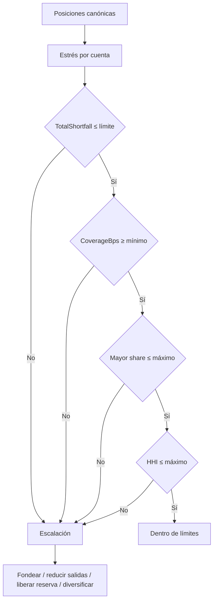

# Riesgo de liquidez

## Propósito

El motor de liquidez responde a dos preguntas distintas:

1. ¿La cartera agregada cubre sus salidas bajo estrés?
2. ¿Qué cuentas concentran el requerimiento o presentan un déficit individual?

Un exceso agregado no compensa automáticamente un déficit localizado. Por eso el informe conserva
ambas magnitudes: `totalSurplus` y `totalShortfall`.

## Posición de entrada

| Campo               | Símbolo | Descripción                          |
| ------------------- | ------- | ------------------------------------ |
| `available`         | `Aᵢ`    | Liquidez disponible inmediata.       |
| `reserved`          | `Rᵢ`    | Reserva sujeta a tasa de liberación. |
| `locked`            | `Kᵢ`    | Saldo no utilizable en el horizonte. |
| `expectedInflow`    | `Iᵢ`    | Entrada contractual esperada.        |
| `committedOutflow`  | `Oᵢ`    | Salida comprometida antes de estrés. |
| `inflowRecoveryBps` | `ρᵢ`    | Fracción recuperable de entradas.    |
| `outflowStressBps`  | `σᵢ`    | Incremento de salida en estrés.      |
| `reserveReleaseBps` | `λᵢ`    | Fracción de reserva liberable.       |

`locked` se registra como contexto de posición, pero no forma parte de la liquidez utilizable.

## Cálculo por cuenta

Con `B = 10 000`:

```text
RecoveredInflowᵢ   = floor(Iᵢ × ρᵢ / B)
StressedOutflowᵢ  = Oᵢ + floor(Oᵢ × σᵢ / B)
ReleasableReserveᵢ = floor(Rᵢ × λᵢ / B)
Usableᵢ            = Aᵢ + RecoveredInflowᵢ + ReleasableReserveᵢ
Surplusᵢ           = max(Usableᵢ - StressedOutflowᵢ, 0)
Shortfallᵢ         = max(StressedOutflowᵢ - Usableᵢ, 0)
```

## Agregación

```text
TotalUsable    = Σ Usableᵢ
TotalOutflow   = Σ StressedOutflowᵢ
CoverageBps    = floor(TotalUsable × B / TotalOutflow)
Requirementᵢ = floor(StressedOutflowᵢ × B / TotalOutflow)
HHI            = Σ floor(Requirementᵢ² / B)
```

Si `TotalOutflow = 0`, la cobertura se representa con el máximo soportado y las participaciones son
cero. La cartera debe ordenar cuentas de forma canónica y rechaza duplicados.

## Ejemplo numérico

### Entradas

| Cuenta          |     `A` |     `R` |     `I` |     `O` |   `ρ` |   `σ` |   `λ` |
| --------------- | ------: | ------: | ------: | ------: | ----: | ----: | ----: |
| `custody:atlas` | 400 000 | 100 000 |  80 000 | 600 000 | 8 000 | 2 000 | 5 000 |
| `custody:forge` | 500 000 |  80 000 | 100 000 | 300 000 | 7 000 | 1 000 | 5 000 |

### Cuenta Atlas

```text
RecoveredInflow   = floor(80 000 × 8 000 / 10 000) = 64 000
ReleasableReserve = floor(100 000 × 5 000 / 10 000) = 50 000
StressedOutflow   = 600 000 + 120 000                   = 720 000
Usable            = 400 000 + 64 000 + 50 000          = 514 000
Shortfall         = 720 000 - 514 000                   = 206 000
```

### Cuenta Forge

```text
RecoveredInflow   = floor(100 000 × 7 000 / 10 000) = 70 000
ReleasableReserve = floor(80 000 × 5 000 / 10 000)  = 40 000
StressedOutflow   = 300 000 + 30 000                    = 330 000
Usable            = 500 000 + 70 000 + 40 000           = 610 000
Surplus           = 610 000 - 330 000                    = 280 000
```

### Cartera

```text
TotalUsable  = 1 124 000
TotalOutflow = 1 050 000
CoverageBps  = floor(1 124 000 × 10 000 / 1 050 000) = 10 704

ShareAtlas = floor(720 000 × 10 000 / 1 050 000) = 6 857
ShareForge = floor(330 000 × 10 000 / 1 050 000) = 3 142
HHI        = floor(6 857² / 10 000) + floor(3 142² / 10 000)
           = 4 701 + 987 = 5 688
```

Aunque los recursos agregados superan las salidas, Atlas presenta un déficit de `206 000`. Con una
cobertura mínima de `11 000 bps` y déficit máximo cero, `withinLimits` es `false`.

## Árbol de decisión



## Interpretación

### Cobertura

- `< 10 000 bps`: recursos agregados inferiores a salidas estresadas;
- `10 000 bps`: cobertura exacta;
- `> 10 000 bps`: colchón agregado;
- una cobertura alta no elimina el riesgo de una cuenta aislada.

### HHI

El HHI se calcula sobre requerimientos de salida, no sobre balances. Aumenta cuando pocas cuentas
concentran el flujo comprometido. El redondeo de cada participación ocurre antes de elevar al
cuadrado, por lo que el resultado es reproducible entre C++ y TypeScript.

### Déficit y excedente

`totalShortfall` suma solo los déficits. `totalSurplus` suma solo los excedentes. No deben netearse
para decidir si una cuenta puede cumplir, salvo que exista un mecanismo operativo de transferencia
inmediata expresamente modelado.

## Selección de factores

Los factores deben proceder de una política versionada:

- `ρ` disminuye ante incertidumbre de cobro o correlación de contrapartes;
- `σ` aumenta con volatilidad de retiradas y compromisos contingentes;
- `λ` disminuye si la reserva tiene demora, haircut o restricción legal;
- los límites deben aprobarse mediante control de cambios;
- una modificación debe registrar epoch, responsable, motivación y evidencia.

## Uso CLI

```bash
out/bastiondtl scenario liquidity --json
```

Campos operativos principales:

```text
liquidity.totalStressedOutflow
liquidity.totalShortfall
liquidity.coverageBps
liquidity.requirementHhiBps
liquidity.largestRequirementShareBps
liquidity.withinLimits
liquidity.accounts[].shortfall
liquidity.digest
```

## Uso SDK

```ts
import { evaluateLiquidity } from "../sdk/BastionClient";

const report = evaluateLiquidity(positions, {
  minCoverageBps: 11_000,
  maxSingleRequirementShareBps: 7_000,
  maxRequirementHhiBps: 6_000,
  maxTotalShortfall: 0n,
});

if (!report.withinLimits) {
  throw new Error("Liquidity limits rejected the portfolio");
}
```

## Controles de integración

- no convierta `bigint` a `number` para persistir importes;
- mantenga las posiciones identificadas por cuenta y activo;
- rechace duplicados antes de enviar el informe;
- archive entradas y digest junto a la decisión;
- repita la evaluación al cambiar saldo, compromiso o parámetro;
- trate `withinLimits = false` como bloqueo, no como advertencia informativa.
