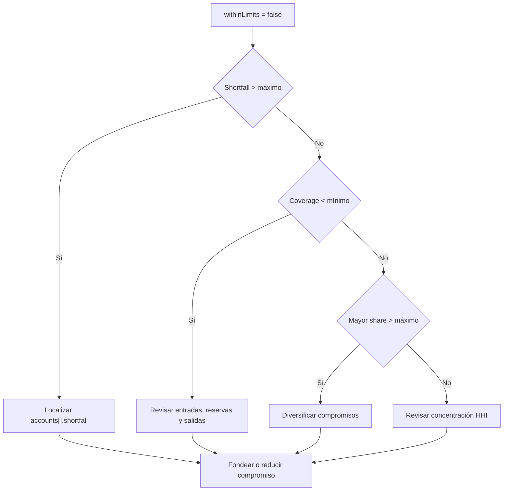

# Runbooks

## Principios

Cada runbook comienza preservando evidencia y termina con un criterio de salida comprobable. No
aplique movimientos manuales sobre balances. Use comandos de dominio, control de cambios y
reconciliación.

## 1. Reconciliación negativa

### Señal

- `reconciliation.ok = false`;
- diferencia de suministro;
- cuenta cerrada con saldo;
- política corriente inesperada;
- digest distinto entre observadores.

### Respuesta

1. detenga admisión de nuevos lotes;
2. conserve JSON, versión, epoch y logs correlacionados;
3. compare `networkId` y configuración entre instancias;
4. identifique la primera entrada del diario donde divergen;
5. compare libro de nonces y manifiestos;
6. no corrija el saldo directamente;
7. prepare una operación compensatoria revisada si procede;
8. repita snapshot y reconciliación.

### Salida

- reconciliación positiva;
- suministro exacto;
- digests iguales para el mismo estado;
- causa y acción registradas.

## 2. Cobertura fuera de límites

### Señal

`liquidity.withinLimits = false`.

### Diagnóstico



### Respuesta

1. bloquee nuevos compromisos que aumenten el requerimiento;
2. archive la posición y digest rechazados;
3. identifique déficit, cobertura y concentración dominante;
4. confirme que factores de estrés corresponden a la política vigente;
5. fondee la cuenta, reduzca salidas o libere reserva autorizada;
6. tramite cambios de límite solo con evidencia y gobierno;
7. vuelva a evaluar con las mismas reglas de redondeo.

### Salida

- `withinLimits = true`;
- ninguna cuenta supera su déficit permitido;
- cobertura y HHI dentro de umbral;
- digest y aprobación archivados.

## 3. Operador deshabilitado

### Señal

- firma rechazada;
- identidad deshabilitada;
- cola de recibos pendiente durante una rotación.

### Respuesta

1. confirme la identidad y la cuenta afectadas;
2. detenga la emisión desde el operador retirado;
3. inventaríe recibos emitidos y aún no procesados;
4. construya un manifiesto de handoff;
5. tramite el nuevo grant por el procedimiento aprobado;
6. verifique cuentas de fee, reserva, límites y ventana;
7. procese la cola de forma controlada;
8. reconcilie nonces, saldos y digests.

### Salida

- grant corriente correcto;
- operador anterior sin capacidad de firma activa;
- cola reconciliada;
- sin recibos duplicados;
- snapshot archivado.

## 4. Propuesta bloqueada

### Señal

- estado `waiting` más allá de la ventana esperada;
- quórum insuficiente;
- predecesor pendiente;
- propuesta próxima a caducar.

### Respuesta

1. consulte pesos de aprobación y cancelación;
2. verifique `readyAt`, `expiresAt` y epoch actual;
3. valide estado del predecesor;
4. confirme firmas y roles de revisores;
5. no duplique votos;
6. si los parámetros cambiaron, cancele y cree una propuesta nueva;
7. si caducó, no intente ejecutarla;
8. archive el informe de gobierno.

### Salida

- propuesta ejecutada, cancelada o caducada de forma inequívoca;
- no quedan acciones externas basadas en una revisión obsoleta;
- digest final compartido entre observadores.

## 5. Nonce repetido

### Señal

Un recibo es rechazado porque su nonce o identificador ya fue consumido.

### Respuesta

1. no genere de inmediato un recibo sustituto;
2. consulte el libro de recibos y el diario;
3. compare source, beneficiary, gross y receiptId;
4. determine si la respuesta original se perdió por transporte;
5. si ya fue aceptado, devuelva el resultado registrado;
6. si no fue aceptado y el nonce está reservado por error, escale para revisión;
7. reconcilie saldo del origen y destinos.

### Salida

- una sola transición económica para la intención;
- cliente externo actualizado con el resultado definitivo;
- sin reintentos ciegos.

## 6. Cuenta congelada

### Señal

La cuenta aparece `frozen` o sus operaciones son rechazadas por estado.

### Respuesta

1. identifique el evento que activó la congelación;
2. mantenga bloqueados recibos y retiradas;
3. capture balance, grant, policy y diario;
4. analice recibos pendientes sin procesarlos;
5. prepare plan de resolución y criterio de reapertura;
6. obtenga la autorización requerida;
7. aplique el cambio mediante comando de dominio;
8. ejecute snapshot antes de reanudar.

### Salida

- motivo resuelto y documentado;
- reconciliación positiva;
- estado esperado;
- cola pendiente revisada;
- autorización archivada.

## 7. Divergencia de release

### Señal

- el tag no coincide con `package.json`;
- `BuildInfo` o CMake declaran otra versión;
- `production` no apunta al commit del tag;
- el release no contiene el artefacto esperado.

### Respuesta

1. detenga la promoción;
2. compare SHA de `main`, `production` y tag;
3. confirme que el tag es anotado;
4. ejecute `bun run verify:repo`;
5. ejecute CI desde el commit candidato;
6. no mueva un tag publicado para ocultar una divergencia;
7. prepare una versión nueva si el contenido cambió;
8. publique evidencia de integridad.

### Salida

```text
main SHA = production SHA = tag peeled SHA
package version = BuildInfo version = CMake version = tag version
branch CI = green
production CI = green
tag integrity = green
release integrity = green
```

## 8. Timeout del binario

### Señal

`NativeBastionTransport` devuelve `TRANSPORT_ERROR` por timeout.

### Respuesta

1. conserve argumentos, duración y pid si está disponible;
2. no reintente una orden económica sin verificar nonce;
3. ejecute `snapshot` desde un proceso separado;
4. determine si el comando alcanzó el diario;
5. revise contención de recursos y volumen del lote;
6. reduzca el lote solo si el manifiesto permite recomponerlo;
7. ajuste timeout mediante un cambio de configuración revisado.

### Salida

- resultado de la orden original determinado;
- una sola aplicación económica;
- latencia dentro del objetivo;
- causa registrada.

## Plantilla de incidente

```text
Start time:
Detected by:
Network / version / commit:
Affected accounts or changes:
Last known good stateDigest:
Observed stateDigest:
Economic invariants checked:
Containment actions:
Evidence locations:
Recovery steps:
Exit criteria:
End time:
Follow-up owner:
```

## Revisión posterior

Tras cerrar un incidente:

- construya una línea temporal basada en diario y digests;
- identifique control preventivo, detectivo y de recuperación;
- añada una prueba reproducible;
- actualice el runbook si la respuesta real difirió;
- asigne responsable y fecha a acciones pendientes;
- verifique el cambio mediante CI y revisión independiente.
