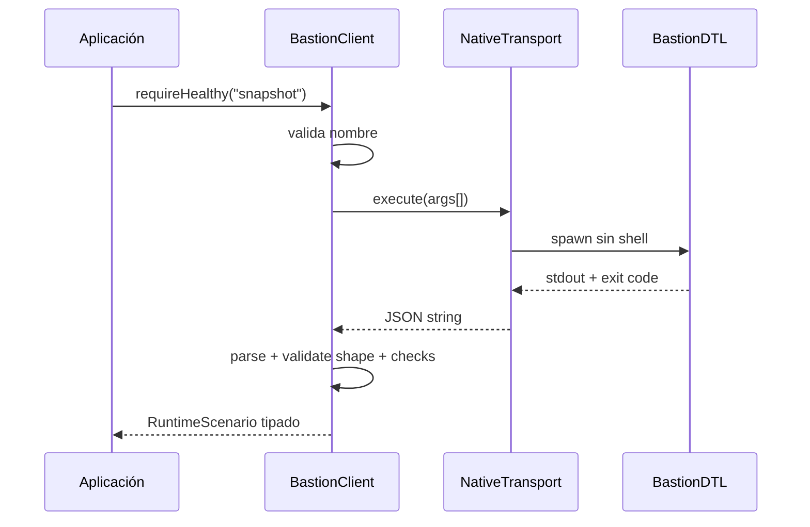

# SDK TypeScript

## Descripción

`sdk/BastionClient.ts` ofrece dos capacidades:

- transporte seguro hacia el binario BastionDTL;
- evaluación de liquidez con `bigint` equivalente al motor C++.

El SDK no oculta una respuesta negativa. Una orden, JSON o forma de datos no válida produce
`BastionClientError` con un código estable.

## Construcción del cliente

```ts
import { BastionClient, NativeBastionTransport } from "../sdk/BastionClient";

const transport = new NativeBastionTransport({
  binary: process.platform === "win32" ? "out/bastiondtl.exe" : "out/bastiondtl",
  cwd: process.cwd(),
  timeoutMs: 10_000,
});

const client = new BastionClient(transport);
```

`shell` permanece desactivado. Los argumentos se pasan como vector y el nombre del escenario se
valida antes de invocar el proceso.

## Listar escenarios

```ts
const scenarios = client.listScenarios();
```

La respuesta debe tener la forma `{ scenarios: string[] }`. Un elemento vacío o de otro tipo se
rechaza.

## Ejecutar un escenario

```ts
const state = client.runScenario("snapshot");

console.log(state.networkId);
console.log(state.stateDigest);
console.log(state.checks);
```

La validación exige:

- `ok` booleano;
- `scenario` y `networkId` no vacíos;
- `epoch` entero seguro;
- `stateDigest` presente;
- array de checks con `name`, `ok` y `detail`;
- array de notas.

## Exigir estado positivo

```ts
const state = client.requireHealthy("snapshot");
```

Si `ok` es falso o algún check es negativo, el método lanza `CONTROL_REJECTED` e incluye los nombres
de los controles afectados.

```ts
try {
  client.requireHealthy("liquidity");
} catch (error) {
  if (error instanceof BastionClientError && error.code === "CONTROL_REJECTED") {
    console.error(error.message);
  }
}
```

## Transporte inyectable

Las pruebas o un adaptador remoto pueden implementar `BastionTransport`:

```ts
import type { BastionTransport } from "../sdk/BastionClient";

class RecordedTransport implements BastionTransport {
  execute(args: readonly string[]): string {
    return loadRecordedResponse(args);
  }
}
```

El contrato es deliberadamente pequeño. La implementación debe devolver el `stdout` completo o
lanzar un error de transporte.

## Evaluación de liquidez

```ts
const report = client.assessLiquidity(
  [
    {
      account: "custody:atlas",
      asset: "usdc",
      available: 400_000n,
      reserved: 100_000n,
      locked: 50_000n,
      expectedInflow: 80_000n,
      committedOutflow: 600_000n,
      inflowRecoveryBps: 8_000,
      outflowStressBps: 2_000,
      reserveReleaseBps: 5_000,
    },
  ],
  {
    minCoverageBps: 11_000,
    maxSingleRequirementShareBps: 7_000,
    maxRequirementHhiBps: 6_000,
    maxTotalShortfall: 0n,
  },
);
```

Tipos admitidos para importes:

```ts
type AmountInput = bigint | number | string;
```

Use `bigint` de forma preferente. Un `number` solo se acepta si es un entero seguro. Los valores
negativos, fraccionarios o fuera de rango se rechazan.

## Serialización de bigint

`JSON.stringify` no serializa `bigint` directamente. Defina una representación de transporte:

```ts
const json = JSON.stringify(report, (_key, value) =>
  typeof value === "bigint" ? value.toString() : value,
);
```

Al recuperar:

```ts
const amount = BigInt(record.totalShortfall);
```

No convierta importes a `number` si pueden superar `Number.MAX_SAFE_INTEGER`.

## Códigos de error

| Código              | Causa                                         |
| ------------------- | --------------------------------------------- |
| `INVALID_BINARY`    | Ruta de binario vacía.                        |
| `TRANSPORT_ERROR`   | El proceso no pudo iniciarse o agotó timeout. |
| `COMMAND_REJECTED`  | El binario devolvió código distinto de cero.  |
| `INVALID_JSON`      | La salida no es JSON.                         |
| `INVALID_RESPONSE`  | La forma del contrato no coincide.            |
| `INVALID_SCENARIO`  | Nombre de escenario no canónico.              |
| `CONTROL_REJECTED`  | Estado o checks negativos.                    |
| `EMPTY_PORTFOLIO`   | No se enviaron posiciones.                    |
| `DUPLICATE_ACCOUNT` | La misma cuenta aparece más de una vez.       |
| `INVALID_AMOUNT`    | Importe negativo, fraccional o no seguro.     |
| `INVALID_BPS`       | Puntos básicos fuera de rango.                |
| `INVALID_RATIO`     | Denominador cero u operandos no válidos.      |

## Patrón de integración



## Pruebas

```bash
bun run test:sdk
bun run typecheck
```

La suite cubre:

- paridad matemática con el escenario nativo;
- orden canónico y concentración;
- redondeo entero;
- cuentas duplicadas;
- importes no seguros;
- contrato de lista y escenario;
- JSON mal formado;
- nombres no canónicos;
- controles negativos.

## Recomendaciones

- establezca un timeout acorde al proceso integrador;
- use una ruta de binario absoluta en servicios;
- valide el hash del artefacto durante el despliegue;
- archive `stateDigest` junto a la respuesta consumida;
- no reintente automáticamente una orden económica sin consultar su nonce;
- diferencie error de transporte, rechazo del comando y control negativo;
- mantenga el SDK y el binario en la misma versión de release.
