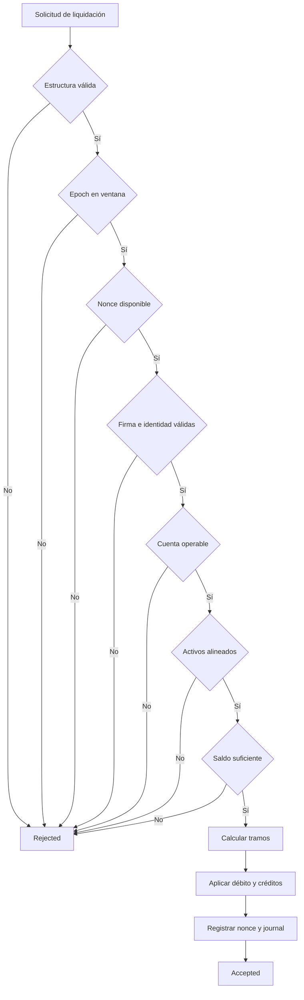
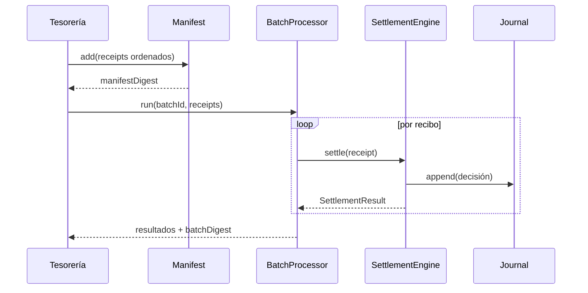

# Modelo de liquidación

## Unidad contable

Todos los importes se expresan en unidades mínimas enteras del activo. BastionDTL no almacena una
cantidad monetaria en coma flotante. La precisión visible corresponde al adaptador externo; el
núcleo solo conoce enteros y el `AssetId`.

Una cuenta mantiene el vector:

```text
Balance = (available, reserved, locked)
Total   = available + reserved + locked
```

El suministro de un activo es la suma de `Total` para todas sus cuentas.

## Recibo

Un recibo incluye como mínimo:

| Campo                | Finalidad                                |
| -------------------- | ---------------------------------------- |
| `sourceAccount`      | Cuenta que soporta el débito.            |
| `beneficiaryAccount` | Destino del importe neto.                |
| `grossAmount`        | Importe bruto en unidades mínimas.       |
| `nonce`              | Identificador monotónico de un solo uso. |
| `notBefore`          | Primer epoch permitido.                  |
| `expiresAt`          | Último epoch permitido.                  |
| `issuingOperator`    | Identidad que autoriza el recibo.        |
| `policyDigest`       | Compromiso de los parámetros de emisión. |
| `signature`          | Firma del payload canónico.              |

La firma cubre campos económicos y de autorización. Añadir un campo sin incorporarlo al payload
firmado rompe el contrato de integridad y no se admite.

## Distribución

Sea `B = 10 000`, `G` el importe bruto, `f` la comisión y `r` la reserva:

```text
fee         = floor(G × f / B)
reserve     = floor(G × r / B)
beneficiary = G - fee - reserve
```

Condiciones previas:

```text
0 ≤ f ≤ B
0 ≤ r ≤ B
f + r ≤ B
available(source) ≥ G
asset(source) = asset(beneficiary) = asset(fee) = asset(reserve)
```

La identidad exacta es:

```text
G = beneficiary + fee + reserve
```

### Ejemplo

Para `G = 25 000`, `f = 40 bps` y `r = 25 bps`:

```text
fee         = floor(25 000 × 40 / 10 000) = 100
reserve     = floor(25 000 × 25 / 10 000) = 62
beneficiary = 25 000 - 100 - 62             = 24 838
```

No se distribuye el residuo de las divisiones. Permanece en el tramo del beneficiario por
construcción de la resta final.

## Orden de validación



Los rechazos devuelven una decisión y un motivo sin aplicar movimientos parciales.

## Estado de cuenta

| Estado    | Recibos                   | Retiradas                | Cambio de operador         | Cierre               |
| --------- | ------------------------- | ------------------------ | -------------------------- | -------------------- |
| `open`    | Permitidos bajo política. | Según modo.              | Permitido al owner.        | Requiere transición. |
| `frozen`  | Bloqueados.               | Bloqueadas.              | Operación de recuperación. | Bloqueado.           |
| `closing` | Bloqueados.               | Solo vaciado autorizado. | Bloqueado.                 | Al quedar vacía.     |
| `closed`  | Bloqueados.               | Bloqueadas.              | Bloqueado.                 | Final.               |

## Nonce y consumo

El nonce se evalúa en el contexto de la cuenta origen. El libro de recibos mantiene identificadores
aceptados y evita que el mismo compromiso contable se procese dos veces. Una integración debe:

1. reservar el nonce antes de emitir;
2. no reutilizarlo tras un resultado aceptado;
3. reconciliar estados inciertos consultando el libro;
4. distinguir un rechazo determinista de un fallo de transporte;
5. conservar el `receiptId` junto al asiento externo.

## Procesamiento por lotes

`BatchSettlementRequest` agrega recibos bajo un `batchId` y un `submitter`. El parámetro
`continueOnError` decide si el procesador continúa tras un rechazo individual. No cambia la
atomicidad de cada recibo.



El manifiesto permite comparar el conjunto previsto con el lote ejecutado. Los digests deben
almacenarse junto a la evidencia de reconciliación.

## Reconciliación

`LedgerReconciler` recorre cuentas, activos y grants. Como mínimo verifica:

- total de cada cuenta;
- cuenta cerrada sin saldo;
- número de políticas corrientes y retiradas;
- operador y política visibles;
- suministro por activo;
- consistencia entre libro y estado.

La reconciliación no sustituye el resultado de una operación: es una comprobación independiente del
estado acumulado.

## Casos límite

- `G = 0` se rechaza en la construcción del recibo.
- `fee + reserve = 10 000 bps` deja neto cero y requiere política explícita.
- importes próximos al límite de `int64` pasan por operaciones comprobadas.
- un destino con activo distinto se rechaza antes del débito.
- una ventana invertida o vacía no se construye.
- una cuenta sin grant actual no puede emitir un recibo corriente.

## Evidencia recomendada

Para cada ciclo de liquidación conserve:

```text
networkId
epoch
receiptId / manifestDigest / batchDigest
sourceAccount / beneficiaryAccount
gross / beneficiaryAmount / operatorFee / reserveAmount
stateDigest before / after
reconciliation.digest
```
